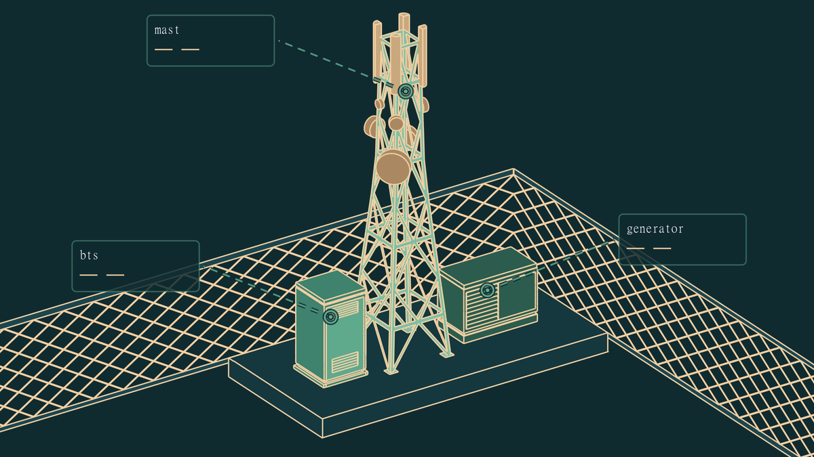
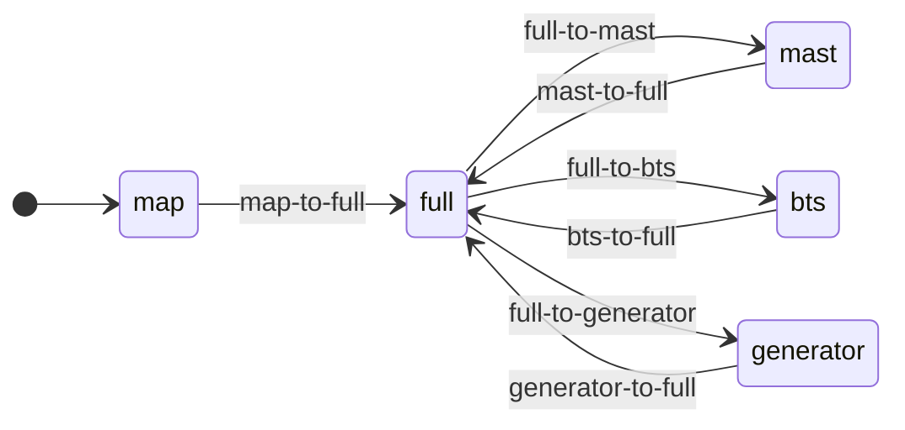
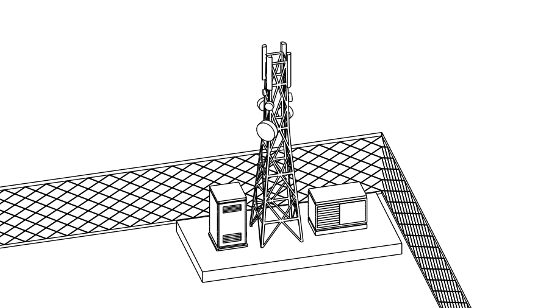
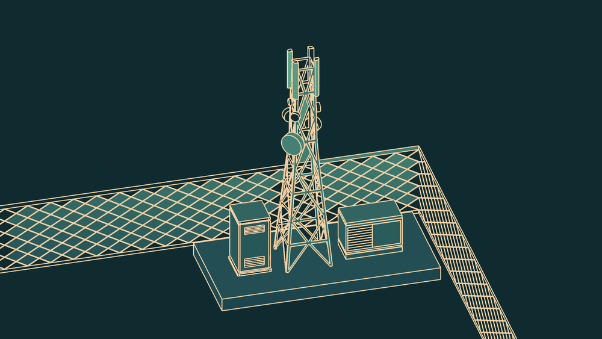

# Aegis Pulse

**A network operations dashboard that renders a 3D telemetry scene without shipping a 3D engine.**

Aegis Pulse monitors GSM tower health across six sites in five Iraqi governorates. Its
centrepiece is the Tower View: an interactive, perspective-correct 3D site model the operator
can fly around — mast, BTS cabinet, power generator — with live sensor readings anchored to the
structure in space.

There is no WebGL context, no scene graph, no runtime renderer, and no 3D library in the bundle.
The entire experience is **four SVG files and seven short MP4 clips**, orchestrated by a state
machine that makes the seam between them invisible.

<p align="center">
  
  <br>
  <em>Overlay registration harness — leader lines resolve from card anchors to exact points on the vector artwork.</em>
</p>

---

## Contents

- [The render model](#1-the-render-model)
- [The transition graph](#2-the-transition-graph)
- [The frame-exact hand-off](#3-the-frame-exact-hand-off)
- [Failure containment](#4-failure-containment)
- [The SVG pipeline: Freestyle → ID-colour → semantic retheme](#5-the-svg-pipeline-freestyle--id-colour--semantic-retheme)
- [One coordinate space, four layers](#6-one-coordinate-space-four-layers)
- [Crop-to-fill with a governor](#7-crop-to-fill-with-a-governor)
- [Graceful degradation](#8-graceful-degradation)
- [Asset budget](#9-asset-budget)
- [Architecture & running it](#architecture)

---

## 1. The render model

The insight is that a camera-driven UI spends **almost all of its time at rest**. The user parks
on the full-site view, or on the cabinet close-up, and reads numbers. Motion is a fraction of a
second between those states.

So the two phases get two completely different representations:

| | Resting states | Camera moves |
|---|---|---|
| **Format** | Vector — self-contained themed SVG | Raster — pre-rendered H.264 MP4 |
| **Count** | 4 (`full`, `mast`, `bts`, `generator`) | 7 directed edges |
| **Duration on screen** | Indefinite | ≈0.8 s |
| **Requirement** | Crisp at any DPI, semantically addressable, themeable | Perspective-correct motion, occlusion, parallax |

This buys the strengths of both and pays for the weaknesses of neither:

- **Resting states stay resolution-independent.** The state the operator actually reads is vector.
  It is razor-sharp on a 4K NOC wall and on a phone, and it costs nothing to re-theme — the fill
  palette is driven by the same design tokens as the rest of the app.
- **Resting states stay *addressable*.** Because they're SVG with a component taxonomy baked in
  (§5), the app can anchor overlays, hit-test sections, and drive hover highlighting against real
  geometry. A video frame is an opaque rectangle; this is not.
- **Moves get real 3D.** True camera orbit with correct perspective, self-occlusion of the lattice,
  and parallax between the mast and the fence — the things CSS transforms categorically cannot fake
  — rendered offline in Blender at whatever quality the render farm allows, then replayed at a
  guaranteed cost.

### What was rejected, and why

| Alternative | Why not |
|---|---|
| **three.js / WebGL** | A renderer, a loader, materials, and a lighting rig in the bundle; a GPU context on machines that are often locked-down NOC terminals; and per-frame cost that varies with the client. All to animate seven fixed camera paths that are known at build time. |
| **CSS 3D transforms** | Can scale and skew flat art. Cannot produce occlusion, parallax between depth layers, or a perspective-correct orbit. The fallback path in this repo does exactly this (§8) — the quality gap is the argument. |
| **All video** | Kills the resting state: blurry at high DPI, unthemeable, and — fatally — not addressable, so the entire spatial overlay system would have to be hand-positioned per state and would drift on any re-render. |
| **Animated SVG (SMIL / path interpolation)** | Blender's Freestyle exporter emits per-frame stroke sets, not a morphable topology. Interpolating an orbiting lattice tower between frames means shipping every frame's paths — orders of magnitude larger than the MP4, for a worse result. |

---

## 2. The transition graph

Five nodes, seven directed edges. The clip filename **is** the edge identifier — no manifest lookup,
no mapping table:

```js
export function clipUrl(from, to) {
  return `/tower/clips/${from}-to-${to}.mp4`
}
```



`full` is a hub: every close-up is reached and left through it, which keeps the edge count linear
in the number of sections rather than quadratic. Adding a fourth inspectable section costs two
clips, not eight.

Store actions never touch the video element. They declare intent — `beginTransition(name, from, to)`
— and the stage resolves which clip that implies. Every action is guarded on
`transition.playing`, so the graph can never be in two places at once:

```js
zoomIntoSection(sectionId) {
  if (this.zoomedSection === sectionId || this.transition.playing) return
  this.beginTransition(`zoom-${sectionId}`, this.zoomedSection ?? 'full', sectionId)
  this.zoomedSection = sectionId
}
```

All seven clips are warmed into the HTTP cache with a fire-and-forget `fetch()` on mount, so the
first interaction plays from cache rather than from the network:

```js
function preloadClips() {
  for (const url of PRELOAD_CLIPS) if (url) fetch(url).catch(() => {})
}
```

---

## 3. The frame-exact hand-off

Everything rests on one invariant, enforced at render time in Blender:

> **The last frame of `${from}-to-${to}.mp4` is pixel-identical to `${to}.svg`.**

If that holds, cutting from the video to the still is undetectable. Getting there required
solving a seam at *each* end of the clip.

### The trailing seam

The obvious implementation swaps the still on the video's `ended` event. It flashes — reliably,
on every transition.

The reason: swapping `` starts a *fetch-and-decode*. The browser does not have the new
SVG rasterized at swap time, so for one or more frames the layer underneath still holds the
**outgoing** still — which the video has just stopped covering. The operator sees the full-site
view blink through at the end of a zoom-in.

The fix inverts the timing. The still is swapped on the video's **`playing`** event instead:

```js
// Once the clip is actually rendering (covering the stage), swap the still
// underneath to the destination so its SVG is decoded before the clip ends.
function onClipPlaying() {
  currentStill.value = store.transition.to ?? store.zoomedSection ?? 'full'
}
```

At `playing`, the video is opaque and covering the stage. The swap happens **behind** it, entirely
hidden, and the destination SVG gets the clip's full ≈800 ms to decode. By `ended` the layer is
already rasterized, and hiding the video is a genuinely free cut.

```
               video.play()      'playing'                          'ended'
                    │                │                                 │
still layer   full ─┼────────────────┼─ swap → mast (decodes here) ────┼─► visible
video layer  hidden ┼── show ────────┼────── opaque, covering ─────────┼─► hidden
                    │                │                                 │
                    └─ ~1 frame ─────┴────────── ≈800 ms ──────────────┘
                                                                       ▲
                                                    destination already rasterized
                                                    → the cut costs nothing
```

### The leading seam

`map → full` has no *source* still — the user is arriving from the map view, and nothing tower-
shaped should be on screen yet. But the still layer initialises to `full`, so the destination
frame popped in *before* its own arrival animation played.

`v-if` would fix the pop and reintroduce the trailing seam, because an unmounted `` decodes
nothing. So the element stays mounted and is hidden with **opacity only**:

```js
// Arriving from the map: hide the full still until the clip finishes — otherwise
// it pops in before the arrival animation. It stays decoded underneath (opacity
// only), so the hand-off at the end is still instant.
const isEntryPending = computed(
  () => store.transition.playing && store.transition.from === 'map',
)
```

Invisible to the user, fully decoded for the hand-off. Both seams closed without compromising
either.

---

## 4. Failure containment

A pre-rendered pipeline has more failure modes than a procedural one — a stalled buffer, a codec
the browser declines, an autoplay policy that rejects `play()`. All of them converge on a single
idempotent resolver:

```js
video.addEventListener('ended',   finishTransition, { once: true })
video.addEventListener('error',   finishTransition, { once: true })
video.play().catch(finishTransition)
safetyTimer = setTimeout(finishTransition, 6000)   // clip stalled / never ends
```

`finishTransition()` clears the timer, detaches every listener, forces the still to the
destination state, and resolves the store. Whichever path fires first wins; the rest are no-ops.

The worst realistic outcome is therefore **an instant cut instead of an animation** — never a stuck
overlay, never a view locked mid-transition, never a `transition.playing` flag that stays true and
deadlocks the interaction guards.

---

## 5. The SVG pipeline: Freestyle → ID-colour → semantic retheme

Blender's Freestyle SVG exporter emits **strokes only**. The output is a clean perspective line
drawing with no fills at all — every surface is a hole.

<p align="center">
  
  
  <br>
  <em>Left: raw Freestyle export (strokes only). Right: the committed still after fill + retheme.</em>
</p>

Filling those regions automatically is a hard problem — the exporter provides no region topology,
and inferring it from stroke intersections is fragile against a lattice tower where hundreds of
braces cross. So the surfaces were filled by hand in Blender, but painted in a deliberately
chosen palette: **eight pure-channel sentinel colours**, one per component class.

| Sentinel | Component | `data-component` | Themed to | Design token |
|---|---|---|---|---|
| `#ff0000` | mast structural beams | `mast` | `#7FBFA4` | one tint above `zain-accent-bright` |
| `#0000ff` | sector antennas (×4) | `sectors` | `#C9A87E` | `zain-sand-dim` |
| `#00ff00` | dish antenna | `dish` | `#A98862` | one shade below `zain-sand-dim` |
| `#ffff00` | BTS cabinet body | `cabinet` | `#3F826D` | `zain-accent` |
| `#ff00ff` | BTS cabinet door | `door` | `#5FA98D` | `zain-accent-bright` |
| `#00ffff` | power generator | `generator` | `#2C5C4D` | `zain-accent-deep` |
| `#ff8000` | concrete base slab | `base` | `#15373E` | `zain-dark-raised` |
| `#8000ff` | perimeter fence strips | `fence` | `#1C454E` | `zain-dark-edge` |

Line-art strokes are unified to `#F2D0A4` (`zain-sand`) — the same token the panel uses for key
values, which is why the artwork and the UI chrome read as one surface.

The sentinels were picked to sit at the extremes of the colour cube — maximally separable, trivially
matched exactly, and guaranteed never to collide with the app's muted palette.

**The point of this is not the colours. It is that the artist's fill choice is simultaneously a
semantic annotation of the scene.** A one-off transform reads each sentinel and rewrites it into a
tagged, themed group:

```html
<g data-component="mast" fill="#7FBFA4"> … </g>
<g data-component="door" fill="#5FA98D"> … </g>
```

The committed stills therefore carry their own component taxonomy — `mast`, `cabinet`, `door`,
`generator`, `base`, `fence`, `dish`, `sectors` — which is exactly what the overlay anchors and
click hotspots key off downstream. Painting the model *is* labelling the model. Re-theming is a
palette swap; re-tagging never has to happen again.

The same pass flattens the exporter's boilerplate and collapses redundant transform nesting:

| Still | Blender source | Committed | Reduction |
|---|---:|---:|---:|
| `full.svg` | 1.59 MiB | **420 KiB** | 74% |
| `mast.svg` | 2.15 MiB | **174 KiB** | 92% |
| `bts.svg` | 545 KiB | **153 KiB** | 72% |
| `generator.svg` | 795 KiB | **217 KiB** | 73% |
| **Total** | **5.05 MiB** | **963 KiB** | **81%** |

> **Implementation note.** Freestyle's export embeds a hidden `<image display:none>` reference
> carrying *its own* `matrix(…)` transform, ahead of the real artwork. A naïve "first matrix in the
> document" extraction picks up the decoy and renders the entire filled scene as a thumbnail in the
> corner. The transform must be keyed off the `<g label="strokes">` group specifically.

---

## 6. One coordinate space, four layers

The stage is four superimposed layers that must stay registered to sub-pixel accuracy at every
viewport size, or the leader lines detach from the structure they point at.

```
┌─ stage box · aspect-locked 16:9 ─────────────────────────┐
│                                                          │
│  4  HTML overlay cards      position: % of artwork space │
│  3  <video> clip player     1280×720 · shown only in-move│
│  2  leader lines + dots     <svg viewBox="0 0 1920 1080">│
│  1   resting still     <svg viewBox="0 0 1920 1080">│
│                                                          │
└──────────────────────────────────────────────────────────┘
```

Layers 1–3 are natively 16:9 and share the artwork's `1920×1080` space — the overlay SVG declares
the *identical* viewBox as the still, so a dot at `(985, 428)` in the geometry table lands on the
inclinometer housing by construction rather than by tuning. Layer 4 is HTML (for real text
rendering and hit targets) and re-enters the same space by expressing its position as a percentage
of it:

```js
function cardStyle(overlay) {
  return {
    left: `${(overlay.cardPos.x / VIEW_W) * 100}%`,
    top:  `${(overlay.cardPos.y / VIEW_H) * 100}%`,
    transform: overlay.side === 'left'
      ? 'translate(calc(-100% - 8px), -50%)'
      : 'translate(8px, -50%)',
  }
}
```

Because the container is aspect-locked, one percentage is correct at every size. The registration
never needs a resize handler.

---

## 7. Crop-to-fill with a governor

Letterboxing a 16:9 stage into a tall viewport wastes vertical space — badly on mobile. Naively
switching to cover-fit crops uncontrollably on extreme aspect ratios and pushes the tower's
antennas off-screen.

The solution is a pure-CSS clamp: **cover, but never more than `(1 + MAX_CROP)×` a plain contain-fit**,
then letterbox the remainder. No JavaScript in the layout path.

```js
const MAX_CROP = 0.75              // 0 = always letterbox · 1 = up to 2× (heavy crop)

const fitW      = `min(100cqw, calc(${stageAspect} * 100cqh))`
const coverW    = `max(100cqw, calc(${stageAspect} * 100cqh))`
const stageWidth = `min(${coverW}, calc(${1 + MAX_CROP} * ${fitW}))`
```

Two details make it work:

- The stage is a flex item, so it needs **`shrink-0`**. Without it, flexbox helpfully undoes the
  deliberate overflow and the crop silently does nothing — a change that appears to have no effect
  at all.
- The container-query units (`cqw` / `cqh`) resolve against the stage's own `[container-type:size]`
  box, which keeps the maths independent of ancestor padding.

### Keeping cards inside the crop

Cropping hides the edges of the artwork — including where some overlay cards live. A
`ResizeObserver` measures the visible root against the full (overflowing) stage box, projects the
visible window back into artwork coordinates, and pulls each anchor inside it:

```js
function clampCard(overlay) {
  const { vw, vh, bw, bh } = box.value
  const fx = Math.min(1, vw / bw), fy = Math.min(1, vh / bh)
  const visX0 = ((1 - fx) / 2) * VIEW_W, visX1 = ((1 + fx) / 2) * VIEW_W
  …
  const x = overlay.side === 'right'
    ? clamp(overlay.card.x, visX0, visX1 - cardW)   // extends right → clamp its left edge
    : clamp(overlay.card.x, visX0 + cardW, visX1)   // extends left  → clamp its right edge
  …
}
```

The clamp is **side-aware**, because a card that extends leftward from its anchor is bounded by a
different edge than one extending right. The leader line needs no separate handling: it is drawn
from the dot to the *clamped* anchor, so it re-solves and simply gets shorter.

---

## 8. Graceful degradation

The entire cinematic pipeline sits behind two flags in [`assets/tower-scene.js`](assets/tower-scene.js):

```js
export const STILLS_AVAILABLE = true
export const CLIPS_AVAILABLE  = true
```

With them off, the stage falls back to a fully functional procedural path — a generated lattice
mast, CSS `scale()` pseudo-zoom, a 5:7 portrait viewBox — and **every** dependent constant switches
with it: the artwork coordinate space, the overlay geometry table, dot radii, stroke widths, dash
patterns, and hit-target boxes.

```js
const VIEW_W = STILLS_AVAILABLE ? 1920 : 500
const DOT_R  = STILLS_AVAILABLE ?   14 :   4
const OVERLAY_GEOMETRY = STILLS_AVAILABLE ? STILL_GEOMETRY : PLACEHOLDER_GEOMETRY
```

This is what let the application be built end-to-end — interaction model, overlay sync, panel
wiring, routing — *before* a single frame was rendered, and it remains the honest answer to "what
if the clips don't load."

---

## 9. Asset budget

| | Count | Size | Spec |
|---|---:|---:|---|
| Resting stills | 4 | **963 KiB** | SVG, `viewBox="0 0 1920 1080"`, self-contained |
| Camera clips | 7 | **4.05 MiB** | H.264 MP4, 1280×720, ≈0.80 s, avg 592 KiB |
| 3D runtime | — | **0 B** | no WebGL, no scene graph, no renderer |
| | | **≈5.0 MiB** | fully cached after first visit |

A comparable three.js scene ships the renderer before it ships a single vertex — and then pays for
every frame, on every client, forever. This pays once, at build time, and replays at a fixed
known cost.

---

## Architecture

Beyond the Tower View, the dashboard is a conventional Nuxt 3 application:

```
pages/index.vue          Map View — real Iraq governorate geometry, animated
                         zoom/pan drill-down with markers carried by the camera
pages/tower/[id].vue     Tower View — the cinematic stage + property panel
components/TowerStage.vue    the render pipeline described above
components/PropertyPanel.vue two-way hover/selection sync with the stage
components/NetworkAnalysis.vue AI triage drawer, deep-links back into the stage
stores/tower.js          single source of truth: telemetry + view state
server/api/analysis.post.js  Gemini structured-output triage (server-only key,
                         SHA-256 content-hash cache, 60 s upstream call floor)
server/api/towers.get.js     telemetry feed
```

**Stack** — Nuxt 3 · Vue 3 (`<script setup>`) · Pinia · Tailwind CSS · Cloudflare Pages
(`cloudflare-pages` Nitro preset; Workers runtime, so server code is Web-API only — `crypto.subtle`,
`fetch`, no `node:*`).

### Running it

```sh
npm install
cp .env.example .env      # fill in the Gemini + weather keys (optional; the
                          # dashboard degrades gracefully without them)
npm run dev               # http://localhost:3000
```

```sh
npm run build             # production build (Cloudflare Pages preset)
npm run preview
npm run lint              # oxlint + eslint
```

### Regenerating the cinematic assets

Source `.blend` renders live outside the repo; their exports are committed:

- **Stills** — Freestyle SVG export → hand-fill in the sentinel palette (§5) → retheme →
  `public/tower/stills/*.svg`. Hand-filled sources are kept in [`assets/svg/`](assets/svg/) and the
  sentinel legend in [`assets/svg color coding.txt`](assets/svg%20color%20coding.txt).
- **Clips** — render each camera move to `public/tower/clips/${from}-to-${to}.mp4`. The
  **final frame must match the destination still exactly** (§3); everything else in the pipeline
  tolerates error, and this does not.
